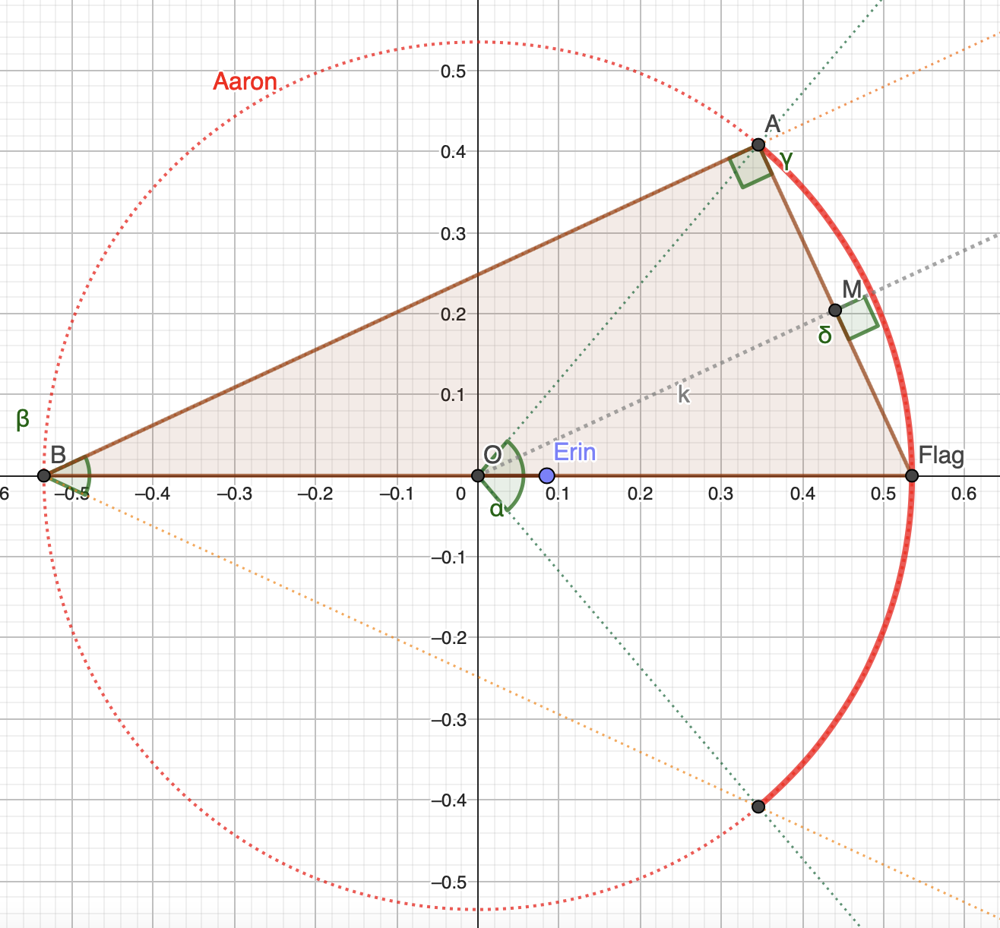
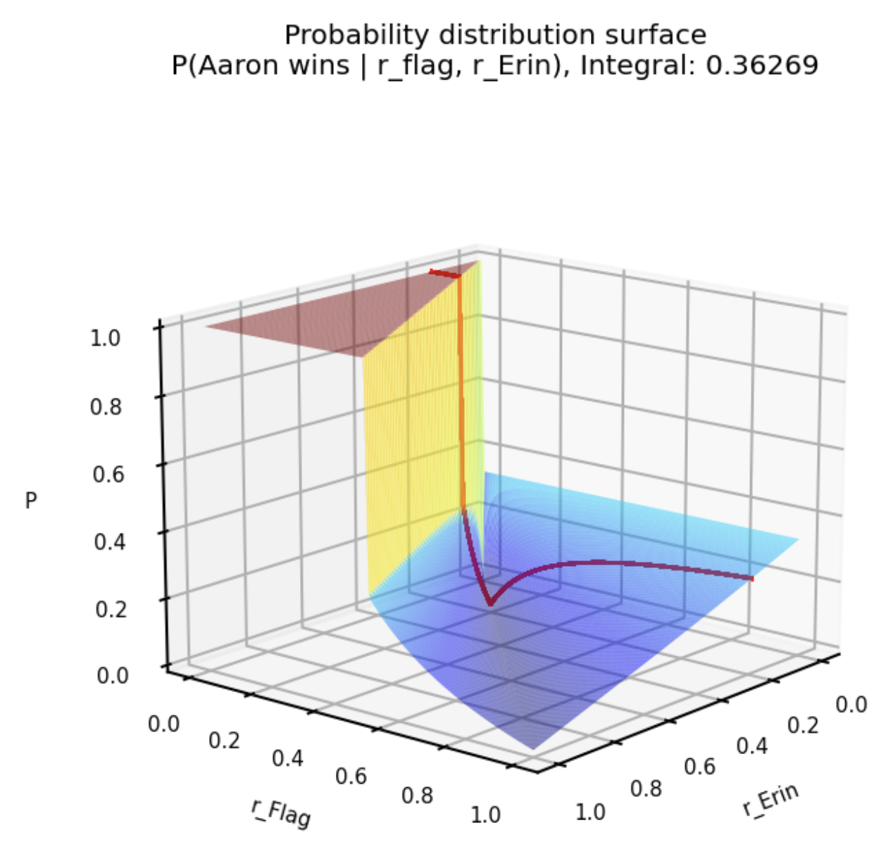

# Jane Street Puzzle
## April 2024 – Robot Capture-the-Flag

## Files:
- JaneStreetPuzzleApril2024.ipynb: Jupyter Notebook
- robot_flag_race.ggb: interactive version of the describe figure below, to be opened on Geogebra (https://www.geogebra.org/classic)
- Solution_idea.png: image used in this presentation to describe the solution
- Distribution.png: image of the probability distribution

## Problem of this puzzle:
It’s been a while and change, but the Robot Games are back once again. This time it’s Capture the Flag!

Two robots, Aaron and Erin, have made it to this year’s final! Initially they are situated at the center of a unit circle. A flag is placed somewhere inside the circle, at a location chosen uniformly at random. Once the flag is placed, Aaron is able to deduce its distance to the flag, and Erin is only able to deduce its direction to the flag. (Equivalently: if (r, θ) are the polar coordinates of the flag’s location, Aaron is told r and Erin is told θ.)

Both robots are allowed to make a single move after the flag is placed, if they wish. Any move they make is without knowledge of what the other robot is doing. (And they may not move outside the circle.)

Whichever robot is closer to the flag after these moves captures the flag and is declared the winner!

During the preliminaries it was discovered that Erin is programmed to play a fixed distance along the detected angle θ. Assuming otherwise optimal play by both robots, can you determine the probability that Aaron will win? (Please express your answer to 10 decimal places.)

## Solution:
The probability of Aaron winning – knowing Erin's fixed distance $e$ to the center – is given by:
$$P(Aaron \space wins|e)= \int_{r=0}^{e/2} 1 \mathrm{d}{r} + \int_{r=e/2}^{1} \frac{4}{2\pi}arcsin(\frac{|r-e|}{2.r}) \mathrm{d}{r}$$

with:
 - $r$ the distance of th flag to the center
 - $e=argmin \space f_A(e)$ where $f_A(e)=P(Aaron \space wins|e)$, $e$ chosen by Erin to minimize Aaron probability to win

## Solution details
### Part I: independant of the discovery that Erin is programmed to play a fixed distance

The angle $θ$ has no importance, can still rotate the circle by $-θ$ to do the same computations. Then let's consider $θ=0$.

The flag is at a distance $r_{Flag}:=r$ from the center $O$ of the unit circle: $Flag = (r, θ)$.

Erin is at a distance $r_{Erin}:=e$ from the center $O$ of the unit circle: $Erin = (e, θ)$.

Aaron can be anywhere on the circle of center $O$, radius $r$ (red circle on the image).

To be closer to the flag than Erin – and therefore to win –, Aaron must be in the circle centred on the $Flag$ and of radius $d = abs(r-e) = |r-e|$ (shaded blue circle on the image). So Aaron must be on the bold part of the red circle that crosses the blue circle. This arc iis centred on $O$ and has an angle $\alpha$, hence it's lenght of ${\alpha}r$, that is proportion of $\frac{{\alpha}r}{2\pi r}=\frac{\alpha}{2\pi}$ of the red circle: probability of Aaron winning if Aaron moves.

Two cases:
  - $|r-e|>=2.r$: Aaron wins win probability 1 (red circle fully inside the blue circle)
  - $|r-e|<2.r$: Aaron wins with probability $\frac{\alpha}{2\pi}$ ($\alpha$ define below)

We need to compute ${\alpha}$ to get the length of this bold red arc and therefore the probability of Aaron winning, knowing $r$ and $e$.

Let's consider the second case ($|r-e|<2.r$):

Then, let's call $B$ the symetric of the point $Flag$ by $O$, and $A$ the intersection of the blue and red circles.

Then the triangle $(A, B, Flag)$ is rectangle in $A$. Therefore, $\beta:=2.\hat{B}=2.arcsin(\frac{AFlag}{BFlag})$ and as $\alpha=2 \beta \space$ *, we have $$\alpha=4.arcsin(\frac{d}{2.r})$$ with $d=AFlag$ and $2.r=BFlag$.

---
#### Proof of $\alpha=2 \beta$:

*Indeed, with* $F := Flag$ *, in the triangle* $(A, B, F)$ *, let's call* $M$ *the middle point of* $[AF]$.

*Then the triangle* $(M, O, F)$ *is rectangle in M, as* $(A, O, F)$ *isocele in* $O$ *and* $M$ *middle of its base. We have* $\hat{ABF}:=\hat{B}$ *,* $\hat{AOF}/2=\hat{MOF}$.

*Then* $\hat{MOF}=arcsin(\frac{MF}{OF})=arcsin(\frac{AF/2}{OF})=arcsin(\frac{d/2}{r})=arcsin(\frac{d}{2r})$ *and* $\hat{B}=arcsin(\frac{AF}{BF})=arcsin(\frac{d}{2r})=\hat{MOF}=\hat{AOF}/2$.

*So* $\hat{AOF}=2\hat{B}$, and multiplying by 2 gives us the desired result:

$$\alpha=2 \beta$$

---

So, we have $P(Aaron \space wins|r, e) = \frac{\alpha}{2\pi}$.

With $r\in[0, 1]$ and $e\in[0, 1]$:

$$P(Aaron \space wins)=\int_{r=0}^{1} \int_{e=0}^{1} P(Aaron \space wins|r, e)\mathrm{d}{e}\mathrm{d}{r}$$

$$P(Aaron \space wins)=\int_{r=0}^{1} \int_{e=0}^{1} \frac{\alpha}{2\pi} 1_{d<2.r} + 1_{d>=2.r} \mathrm{d}{e}\mathrm{d}{r}$$

### Part II: it is known that Erin is programmed to play a fixed distance

Now, Erin is programmed to play a fixed distance, so it looks for the best value $r_{Erin}$, that is the one minimizing the probability of Aaron winning.

Aaron knows the distance that Erin will play, so when the flag is place, Aaron choses to move or not. If $r<\frac{e}{2}$, Aaron doesn't move and wins with proba 1.

$$P(Aaron \space wins|e)= \int_{r=0}^{e/2} 1 \mathrm{d}{r} + \int_{r=e/2}^{1} \frac{\alpha}{2\pi} 1_{|r-e|<2.r} + 1_{|r-e|>=2.r} \mathrm{d}{r}$$

$|r-e|<2.r \iff r>e/3$, indeed: 
  - $r > e$: $|r-e|>2r \iff r + e > 0$, always true
  - $r < e$: $|r-e|>2r \iff r < e/3$

Combined with the previous split $r \in [0, e/2]$ and $r \in [e/2, 0]$, this gives us:

$$P(Aaron \space wins|e)= \int_{r=0}^{e/2} 1 \mathrm{d}{r} + \int_{r=e/2}^{1} \frac{\alpha}{2\pi} \mathrm{d}{r}$$

$$P(Aaron \space wins|e)= \int_{r=0}^{e/2} 1 \mathrm{d}{r} + \int_{r=e/2}^{1} \frac{4}{2\pi}arcsin(\frac{|r-e|}{2.r}) \mathrm{d}{r}$$

